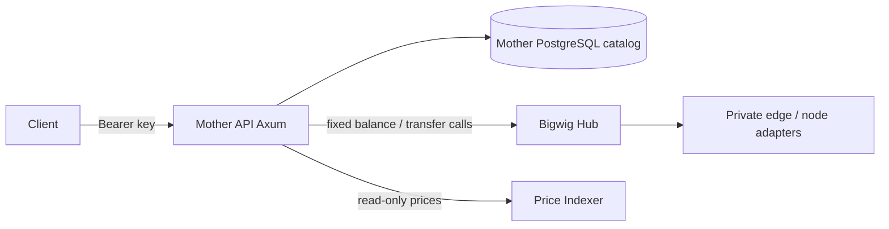
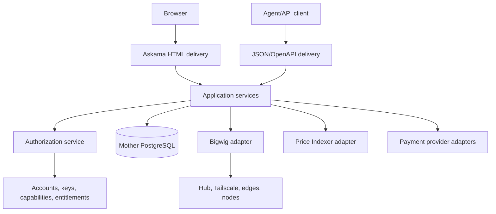
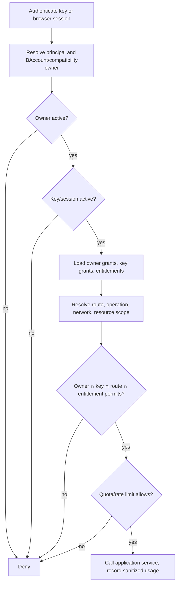
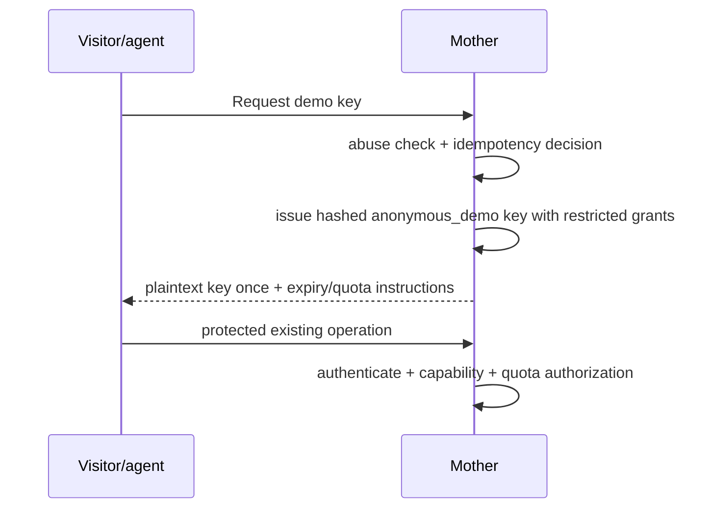
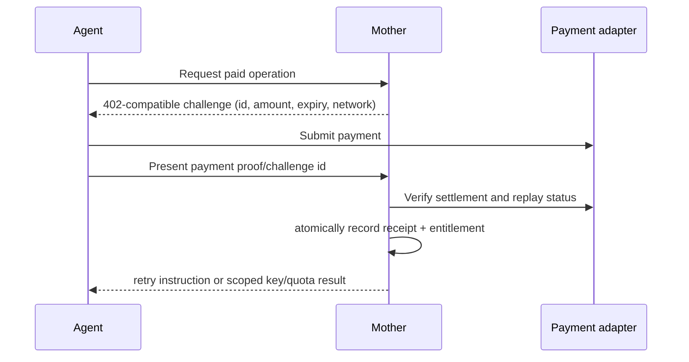
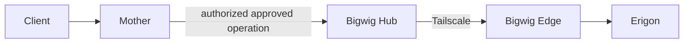

# RFC-003 - Mother API: Accounts, Capabilities, Scan, RPC and Agent Access

## Status

Accepted. This RFC is an internal architecture and release-coordination
decision. It changes no public route by itself; public behavior still requires
an accepted SPEC and the corresponding `CONTRACTS.md` update.

## Internal codename note

The internal development codename **El Vasco** honors the musician Mezo
Bigarrena. The older internal codename was **El Malo**, in honor of the
musician Willie Colón. These names may occur in internal planning and
historical material only. They must not appear in public routes, OpenAPI
descriptions, user-facing HTML, public API documentation, or product copy.

## Summary

Mother API should become the principal Iron Burrow product: one coherent place
for a public homepage, account access, API credentials, Scan and Lab
experiences, and carefully authorized access to Iron Burrow data products.
It remains a product and policy boundary, not a replacement for Bigwig, the
Price Indexer, DIS, or the Read Model.

The recommended first delivery is a **single Mother API Rust runtime** with
Askama server-rendered pages added in a later, dedicated SPEC. It shares
domain and application services with JSON endpoints. The first implemented
vertical slice is smaller: registered `balances.read` and `transfers.read`
capabilities protect the existing private-Beta routes while preserving all
issued-key behavior.

## Context and current state

The following state was verified from routes, migrations, OpenAPI, adapters,
and tests on 2026-07-30:

| Area | Verified current behavior |
| --- | --- |
| Runtime | One `mother-api` Axum binary; no Cargo workspace, Askama dependency, browser session, or HTML route. |
| Public Beta | `GET /health`; `POST /v1/balances`; `POST /v1/balances/bulk`; and feature-gated `POST /v1/erc20-transfers/search`. Exact contracts are in `CONTRACTS.md`. |
| Credentials | Operator CLI issues high-entropy `ib_live_<prefix>.<secret>` bearer keys. Only SHA-256 hashes and non-secret prefixes are stored. |
| Ownership | `api_consumer` currently owns `api_key`; it is a Beta-consumer record, not an IBAccount. |
| Enforcement | Beta middleware authenticates a bearer key, requires active consumer/key and unexpired key, then applies in-memory per-minute and Postgres daily per-key limits. |
| Infrastructure | Balances and transfer extraction call fixed authenticated Bigwig internal endpoints. Mother has no generic RPC, Otterscan, Bitcoin, Lightning, or payment adapter. |
| OpenAPI | Utoipa generates the current JSON API document. |
| Data boundaries | Mother owns catalog data; Price Indexer is read-only for prices; DIS remains a dormant read-only DeFi-intelligence boundary and is not called by current Mother API production behavior. |

The first slice adds `mother_api.capability`, compatibility owner grants, and
key grants. Required capability declarations and compatibility-grant
reconciliation run through the embedded reference-data lifecycle, which gives
all existing consumers and keys only `balances.read` and `transfers.read`.
Middleware now returns the documented `403 capability_not_granted` before quota
consumption when a valid key lacks the route capability. It does **not** create
an IBAccount or expose new product functionality.

## Problem statement

The current bearer-key check proves possession but cannot safely express
product access, account limits, network restrictions, payment entitlements, or
advanced-node safety policy. Building Scan, Lab, anonymous keys, or payment
flows directly on it would duplicate authorization decisions and risk turning
Mother into an unrestricted node gateway.

## Product vision

Iron Burrow offers humans and agents an understandable front door to curated
on-chain data. Visitors can learn about the product, evaluate existing basic
operations with a constrained demo credential, establish an Iron Burrow
Account, and later receive explicit paid or plan-derived access. Scan and Lab
are product surfaces over shared application use cases, not independent node
proxies.

## Product access and growth principles

Mother API exposes curated, documented capabilities rather than becoming a
generic blockchain data or RPC provider. New capability work starts from a
demonstrated consumer problem, then proceeds through an implementation SPEC,
an explicit contract decision where applicable, usage measurement, and
stabilization. Speculative endpoints are not added merely because they might
be useful.

The current `friend`, `partner`, `public`, and `internal` values on
`api_consumer` are operator-managed Beta consumer categories. They are
administrative metadata, not promises of self-service onboarding, dedicated
support, plan-based access, or billing. Protected private-Beta requests use
the implemented consumer/key capability and per-key quota controls; Alpha
public routes remain governed by `CONTRACTS.md`.

## Internal application functions and UI boundary

El Vasco includes internal application and domain functions that support UI
delivery, internal orchestration, and read-model coordination. These functions
are not automatically public API routes and do not require a hardened
`CONTRACTS.md` entry in the same way as the public balances and transfer
operations. They still require clear ownership, authorization where relevant,
tests, and an accepted implementation SPEC when they create a durable
cross-service dependency.

Any public route or stable machine-facing API remains subject to an accepted
SPEC and the corresponding `CONTRACTS.md` update. Internal functions may use a
separate internal caller contract and can evolve without expanding the public
surface.

### Read-model catalog synchronization

The internal El Vasco application layer is the designated location for the
future catalog-discovery/synchronization function used by
`iron-burrow-read-model`. Mother API remains the owner of the canonical
`mother_api.global_asset`, `network`, and `asset_chain_map` catalog; the Read
Model remains the owner of refresh scheduling.

The future internal function or feed may provide the minimal active catalog
entries and refresh quote-currency information needed to build refresh
attempts. It must not turn public `GET /v1/assets` into an operational feed,
promise `/v1/assets/active`, move price derivation or historical price
ownership into Mother API, or expose read-model-specific fields through the
public contract. Its exact transport, visibility, response shape, freshness,
and failure semantics require a focused implementation SPEC before delivery.

## Goals

- Preserve every existing production client route and key behavior.
- Establish deny-by-default, testable capability authorization.
- Add account, key, entitlement, quota, session, and payment concepts in
  separately reviewable steps.
- Serve the homepage and future authenticated HTML from this repository.
- Keep Mother as the public policy boundary and Bigwig as infrastructure
  protection close to nodes.

## Non-goals

- A generic identity platform, custody, wallet control, billing suite, or
  unrestricted RPC proxy.
- Arbitrary database queries, raw Erigon tunnels, Bitcoin wallet RPC,
  Lightning payment execution, or admin node RPC.
- Changing existing JSON route names or request/response shapes.
- Implementing all planned products in this RFC.

## Terminology

| Term | Meaning |
| --- | --- |
| `IBAccount` | Explicit product account identifier and status boundary; not a blockchain address or session. |
| API key | Bearer credential with an ID, prefix, secret hash, kind, status, and narrower grants. |
| Principal | Authenticated browser-session or API-key subject. |
| Capability | Application-defined permission such as `balances.read`. |
| Grant | Capability plus scope/status/expiry granted to an account or key. |
| Entitlement | Plan or verified-payment-derived authority that can contribute account grants or quota. |
| Resource scope | Network, method group, page size, lookback, product surface, or other bounded qualifier. |
| Payment receipt | Evidence handled by a provider adapter; never a bearer credential. |

## Architectural principles

- Deny by default; explicit denies, disabled state, expiry, quota, or
  infrastructure refusal win.
- API keys prove possession only. They never elevate their owner.
- Canonical public network identity is `network_slug`; EIP-155 `chain_id`
  remains distinct and is never a generic `chain` field.
- Delivery code delegates to application/domain policy; templates and handlers
  do not reimplement it.
- Mother and Bigwig enforce in depth. A Mother allow cannot override Bigwig.
- Secrets are display-once where applicable and never logged.

## Current architecture



DIS is intentionally absent from the current-runtime diagram: no current
Mother API capability calls it. `SPEC-001` retains DIS as a possible future
read-only protocol-intelligence boundary.

## Proposed architecture



The delivery layer has JSON API, HTML, OpenAPI, sessions, and CSRF protection.
Application services own onboarding, issuance, authorization, Scan
orchestration, and payments. Adapters contain PostgreSQL, email, Bigwig, Price
Indexer, and provider concerns.

## UI runtime and Cargo workspace decision

Three options were evaluated:

| Option | Result |
| --- | --- |
| Add pages to the existing binary | **Recommended first implementation.** One deployable, shared policy/services, no extra cross-service authentication. |
| Add a separate Rust binary/crate in this repository | Defer. It becomes justified only if independent scaling, isolation, or deployment cadence is concrete. |
| Separate UI application in this repository | Defer. It adds a second runtime, client-side authorization risk, and duplicated contract concerns before the product needs them. |

SPEC-014 adds Askama and static assets to the existing runtime. It must keep
HTML routes outside `/v1`, use progressive enhancement only where it improves
copying/forms, and preserve JSON delivery behavior.

## Product surfaces

| Surface | Responsibility | Access |
| --- | --- | --- |
| Homepage | Explain Iron Burrow, API documentation, Account, demo access, agent access, Scan and Lab links. | Public. |
| Account UI | IBAccount session, verified identity, key management, entitlement/usage views. | Browser session and application authorization. |
| Scan | Network-scoped human inspection of supported addresses, transactions, evidence, balances, and transfers. | Public/Account/API-key policy decided per operation. |
| Lab | Advanced, explicitly granted interactions with curated prices and node-backed capabilities. | Capability and quota controlled. |
| Machine API | Stable documented JSON operations. | API key and capability controlled. |

Scan and Lab are separate route groups and capability levels over shared use
cases, not separate applications in the initial deployment.

## Identity and IBAccount model

`IBAccount` is the public domain term. Its minimal first model has a random
public `iba_*` identifier, immutable internal UUID, status
`pending_verification|active|suspended|closed`, timestamps, and one or more
verified email identities. It does not claim ownership of a blockchain
address. An API key belongs to at most one IBAccount after migration.

Browser sessions authenticate a principal, resolve its IBAccount, and call the
same application authorization service as API-key requests. Session IDs are
opaque, hashed at rest, rotated at login/privilege changes, bound to a limited
lifetime, protected by secure/HTTP-only/same-site cookies, and checked for
CSRF on state-changing browser actions.

```mermaid
sequenceDiagram
  participant U as User
  participant M as Mother
  participant E as Email provider
  U->>M: Sign up with email
  M->>M: create pending IBAccount + verification hash
  M->>E: send one-time verification link
  U->>M: verify link
  M->>M: activate identity/account; create rotated session
  U->>M: account action with session + CSRF token
  M->>M: authorize IBAccount before service call
```

## API-key model

`ApiKey` has an independent secret, public key ID/prefix, kind
`account|anonymous_demo|agent`, label, status, secure hash, issue/expiry/
revocation timestamps, last-used metadata, and key-level grants. Raw secrets
are shown once only. SHA-256 remains acceptable only for generated
high-entropy keys; passwords use a different future mechanism.

Account grants are the upper boundary. Key grants are evaluated dynamically,
not copied as a replacement for the account boundary. A new key can be
narrower; an account grant removal immediately constrains every key. Key
creation may copy a starter proposal for UX but authorization always computes
the intersection.

## Capability and resource-scope model

The immediate registry contains only `balances.read` and `transfers.read`.
Target identifiers, introduced only in their owning SPECS, include:

`prices.read`, `prices.private_query`, `scan.read`, `rpc.basic`,
`rpc.custom`, `otterscan.read`, `bitcoin_core.read`, `lightning.read`, and
network-scoped capabilities such as `ethereum_mainnet.read` where a stable
identifier is useful.

A grant contains capability, network scope (`*` or canonical `network_slug`),
status, expiry, source, and audit fields. Later scopes can include route group,
approved RPC method/method group, maximum page size/lookback, historical-data
permission, concurrency, and quota. Capability IDs are application-defined;
users do not create capabilities.

## Authorization algorithm



Formally:

`effective_access = account_grants ∩ api_key_grants ∩ resource_scope ∩ route_policy ∩ current_entitlements ∩ quota_and_payment_state`.

The compatibility slice substitutes existing `api_consumer` owner grants for
IBAccount grants temporarily. It does not call that record an IBAccount.

| Case | Owner grant | Key grant | Result |
| --- | --- | --- | --- |
| Verified account key | balances + transfers on Ethereum | balances + transfers | Allow matching operations. |
| Narrow key | balances + transfers | balances only | Deny transfer. |
| Anonymous demo | demo baseline | balances only, short expiry | Deny advanced operations. |
| Paid agent | payment-derived scope | narrower agent scope | Allow intersection only. |
| Expired/revoked key | any | inactive | Deny. |
| No network grant | balances on Base | balances on Ethereum | Deny Base. |
| Advanced key request | no Otterscan owner grant | Otterscan key grant | Deny. |

## Anonymous-key flow

Anonymous demo keys should exist without an IBAccount. They use a dedicated
anonymous principal class and audited key record, avoiding fake identities and
an unnecessary provisional-account migration. Creation receives strict
IP/device and abuse controls, rate/day quotas, short expiry, revocation,
display-once secret behavior, and only the approved existing basic
capabilities plus explicit network scopes. No arbitrary RPC, Otterscan,
Bitcoin, Lightning, premium prices, account management, or custom RPC is
allowed.



An upgrade creates or verifies an IBAccount, revokes/links the demo key by an
explicit audited action, and never silently broadens it.

## Verified-account flow

SPEC-015 defines email verification, a minimal recovery mechanism, sessions,
and active/suspended/closed rules. Account creation must have generic public
responses to prevent email enumeration. Key issuance and browser actions use
the same authorization service; browser possession does not bypass account
status, entitlements, or quotas.

## Agent and 402 payment flow

Payment is an entitlement input, not authentication and not a root
credential. A payment provider adapter creates a bounded challenge; a client
pays; the adapter verifies settlement once; Mother records an idempotent
receipt and creates/extends a time-limited entitlement. A key is separately
issued or explicitly extended under that entitlement.



MPP and Coinbase-compatible x402 are provider implementations behind this
boundary. Configuration, not a credential, determines accepted stablecoins and
payment networks. The payment SPEC sets confirmation depth/policy per asset;
pending, failed, expired, underpaid, duplicate, and reversed receipts do not
grant access. Challenges/receipts have expiry, nonce/idempotency keys,
provider transaction uniqueness, audit events, and a deferred but modeled
refund/reversal state.

## Address associations

An association may be watch-only, labelled, user-declared, control-verified,
imported for monitoring, or treasury/organization-labelled. The first version
supports only private watch-only associations and labels. It must never say an
IBAccount owns an address without cryptographic verification. Associations
support saved Scan/Lab views later; they are private account data with clear
retention/deletion policy and must not alter public chain facts.

## Scan architecture

Initial Scan is `/scan/{network_slug}` plus task-oriented address/transaction
routes, not a raw RPC surface. Its MVP is Ethereum-mainnet transaction lookup,
confirmation evidence, address balances, and ERC-20 transfers using existing
Mother/Bigwig capabilities. Browser sessions and API keys can each request
operations only when their route policy and scopes allow them; public Scan
visibility is an explicit operation-level decision, not implied by machine API
visibility. Historical evidence and advanced data arrive in later SPECS.

## Price access

Mother presents curated public price endpoints and scoped premium historical
access while the Price Indexer remains owner of availability, derivation, and
historical data. `prices.private_query` means a curated application query with
validated parameters and limits, never direct database access. Public current
or curated prices, internal query-layer calls, and premium history are distinct
policies.

## Basic and custom RPC

`rpc.basic` is a reviewed method profile with request/response/batch size
limits, parameter schemas, timeouts, concurrency, rate and method policy,
network scope, audit events, and normalized errors. Mother validates product
authorization and request shape; Bigwig independently enforces node-close
method policy and protection. `rpc.custom` is deferred until the basic profile
is proven, then requires explicit per-method grants, elevated approval, and
stronger limits. Neither is implemented by this RFC.

## Otterscan integration

Otterscan is a restricted capability to approved `ots_*` methods, never an
Erigon tunnel. Mother owns principal/key/entitlement policy and an exposed
task-or-constrained-RPC contract; Bigwig owns the node-close allowlist,
parameter/limit defense needed to protect the edge, and supported-capability
discovery. The expected path is:



SPEC-024 decides task-oriented versus constrained RPC-compatible delivery,
API-level probing, version incompatibility behavior, and exact `ots_*`
methods. Anonymous demos are categorically denied.

## Bitcoin Core integration

A future `bitcoin_core.read` capability permits only curated, read-only public
inspection, node status, and transaction/indexed-address information through
Bigwig. Wallet RPC and administrative RPC are excluded unless a later security
review explicitly approves them.

## Lightning integration

A future `lightning.read` capability permits curated read-only node, invoice,
payment-status, channel, and liquidity information. Payment execution and
administrative operations are outside this RFC and the initial implementation.

## Mother and Bigwig boundaries

Mother owns product HTTP/HTML, IBAccounts, keys, sessions, capabilities,
entitlements, plans, quotas, product authorization, Scan/Lab orchestration,
documentation, and product usage records. Bigwig owns private connectivity,
Hub-to-edge routing, node adapters, node-close allowlists, infrastructure
timeouts/limits, and supported-node discovery. Both layers deny independently.

## Proposed persistence model

Immediate migration `0009` adds only the `capability`,
`api_consumer_capability_grant`, and `api_key_capability_grant` schemas. The
embedded reference-data catalog declares the required capability registry and
reconciles legacy owner/key grants after migrations. Their PKs are the natural
owner/capability/network tuple; scopes are `*` or canonical `network_slug`;
status/expiry/revocation/audit timestamps support the next phase; active lookup
indexes serve authorization. They deliberately do not pretend `api_consumer`
is an IBAccount.

| Later table | Key fields and constraints |
| --- | --- |
| `ib_accounts` | UUID PK, unique `iba_*` public ID, status, created/updated/closed timestamps. |
| `account_identities` | UUID PK, IBAccount FK, normalized email hash/value policy, verification status, unique verified identity. |
| `email_verifications` | UUID PK, identity FK, one-time secret hash, purpose, expiry/consumed/revoked timestamps, lookup index. |
| `browser_sessions` | UUID PK, account/identity FK, secret hash, expiry/revoked/rotated fields, active-session indexes. |
| `api_keys` | Retain secret hash/prefix; add `ib_account_id`, kind, and safe legacy migration fields. |
| account/key grants | Account FK or key FK, capability, scope, status, source, expiry/revocation; unique active logical scope. |
| `entitlements` | UUID/public ID, account FK, source/provider reference, capability/plan/quota payload, active window, idempotency uniqueness. |
| `attached_addresses` | UUID, account FK, family/network/address normalized key, association/verification status, label, privacy timestamps. |
| `usage_events` | UUID, principal/key/account IDs, operation/scope/outcome/cost, redacted metadata, time indexes. |
| `payment_challenges` | UUID/public challenge ID, provider/config snapshot, amount/asset/network, nonce/idempotency, expiry/status. |
| `payment_receipts` | UUID, challenge FK, provider transaction uniqueness, verified amount/status/confirmation, reversal/audit fields. |

## API and HTML routes

The following are proposals, not accepted public contracts until their SPECS
and `CONTRACTS.md` changes are accepted:

| Route group | Proposed purpose |
| --- | --- |
| `/` | Homepage for `www.ironburrow.com`. |
| `/docs` | Human API documentation plus link/download for OpenAPI. |
| `/get-api-key` | Demo onboarding; never a privilege escalation endpoint. |
| `/login`, `/verify-email` | Minimal verified-account flow. |
| `/account`, `/account/api-keys` | Authenticated account/key management. |
| `/scan/{network_slug}` | Scan landing and task-oriented detail views. |
| `/lab` | Explicitly authorized advanced product tools. |

Existing `/v1/*` paths remain unchanged. Future JSON endpoints use a versioned
contract, exact route-to-capability mapping, and OpenAPI compatibility tests.

## Security analysis

| Threat | Required control |
| --- | --- |
| Key theft/enumeration/leakage | High entropy, hash-only storage, display once, non-enumerating auth, redact headers/logs/traces. |
| Email/account abuse | Generic responses, short one-time verification tokens, rate limits, expiry, audit, session rotation. |
| Demo farming | Layered issuance abuse controls, strict quota/expiry, no advanced grants, revocation. |
| Capability escalation | Intersection algorithm, owner upper boundary, deny precedence, table-driven tests, immutable capability registry. |
| Cross-account access | Principal-to-account ownership checks in application services; opaque identifiers do not authorize access. |
| RPC DoS/batches/oversize | Mother and Bigwig method/parameter/batch/timeout/response/concurrency limits. |
| 402 replay/forgery | Challenge nonce, provider verification, transaction uniqueness, idempotency, confirmation policy, receipt audit. |
| Address privacy | Private associations, minimal metadata, retention/deletion rules, no ownership claims. |
| Session fixation/CSRF/XSS | Rotate sessions, secure cookies, CSRF checks, Askama autoescaping/default-safe template use and CSP review. |
| Bigwig/edge compromise | Least-privilege service credentials, node-close enforcement, segmented networking, sanitized upstream errors. |
| Bitcoin/Lightning admin exposure | Explicit allowlists; wallet, execution, and admin methods prohibited by default. |

## Quotas and rate limits

The existing per-key minute and daily limits remain unchanged. Later policy
supports per-key, account, capability, method, route, concurrency, anonymous,
and entitlement-derived quota budgets. Reservation/consumption must be atomic
for the resource being limited. Rate limiting and quota decisions are distinct
but both deny before expensive upstream work.

## Auditing and observability

Record opaque principal/key/account IDs, operation/capability/scope, decision,
quota outcome, latency, response class, correlation ID, and upstream class.
Never record raw API keys, session secrets, payment proofs/secrets, provider
credentials, raw sensitive address labels, or unrestricted request bodies.
Alert on issuance spikes, authorization-deny spikes, payment replay attempts,
and Bigwig denials without exposing customer secrets.

## Backward compatibility

`POST /v1/balances`, `POST /v1/balances/bulk`, and enabled
`POST /v1/erc20-transfers/search` retain paths, request/response schemas,
authentication header, and legacy key access. The required reference-data
apply explicitly reconciles each existing consumer and key with exactly the two
pre-existing capabilities. New operator-issued legacy keys receive the same
default grants.
No key becomes more powerful. Missing/expired/revoked credentials retain the
same `401`; a valid but deliberately narrowed future key receives stable `403`.

## Migration and rollout

1. Run `mother-api db apply` so migration `0009` and required capability
   reference data are both applied.
2. Deploy capability-aware code with metrics for grant lookup/denial.
3. Verify all issued production keys have owner and key baseline grants before
   enabling any subsequent route-to-capability policy.
4. Run OpenAPI, route characterization, and disposable-Postgres tests.
5. Roll back application code only after confirming old code tolerates grant
   tables; migrations are additive and retained. Do not delete reference data
   or grants as a rollback mechanism.
6. Feature-gate later public UI, account, demo, payment, Scan, and node work
   independently. No rollout grants an advanced capability by default.

## SPECS required

| SPEC | Purpose / key non-goal | Dependencies | Phase |
| --- | --- | --- | --- |
| SPEC-013 Capability authorization | Grants, scopes, decisions, legacy mapping. Not account UI or advanced operations. | RFC-003 | 1 |
| SPEC-014 Web application and homepage | Askama, static assets, homepage/docs/session plumbing. Not account identity or demo issuance. | SPEC-013 | 2 |
| SPEC-015 IBAccount and verified identity | IBAccount lifecycle, email verification, sessions, recovery. Not general identity federation. | 013, 014 | 3 |
| SPEC-016 API-key lifecycle and classes | Account/demo/agent key lifecycle and upgrade path. Not payment settlement. | 013, 015 | 3 |
| SPEC-017 Quotas, limits, and usage | Account/capability/method quotas and audit usage. Not billing UI. | 013, 016 | 3 |
| SPEC-018 Anonymous and agent onboarding | Demo issuance, abuse controls, agent instructions. Not advanced node access. | 014, 016, 017 | 2/3 |
| SPEC-019 402, MPP, payment entitlements | Challenge/provider/receipt/entitlement flow. Not a root credential or vendor lock-in. | 015–018 | 5 |
| SPEC-020 Mother Scan | Network-scoped Scan routes and Askama views. Not raw RPC. | 014, 017 | 4 |
| SPEC-021 Price API/query layer | Curated current/history/private query capability. Not direct Price Indexer DB access. | 013, 017 | 5 |
| SPEC-022 Curated basic RPC gateway | Reviewed method profile and Bigwig contract. Not arbitrary RPC. | 013, 017 | 6 |
| SPEC-023 Custom RPC grants | Explicit elevated per-method access. Not before basic RPC proves safe. | 022 | 6+ |
| SPEC-024 Otterscan capability | Approved `ots_*`, probing, Bigwig path/policy. Not a raw Erigon tunnel. | 013, 017 | 6 |
| SPEC-025 Bitcoin Core capability | Curated read-only calls. Not wallet/admin RPC. | 013, 017 | 6 |
| SPEC-026 Lightning capability | Curated read-only information. Not payment/admin operations. | 013, 017 | 6 |
| SPEC-027 Attached addresses | Watch-only labels, verification states, privacy. Not custody claims. | 015, 020 | 4+ |
| SPEC-028 Public API documentation | OpenAPI/human docs/errors/compatibility. Not undocumented product expansion. | each public SPEC | continuous |
| SPEC-029 Migration, rollout, legacy compatibility | IBAccount key migration, flags, monitoring, rollback. Not data deletion. | 013, 015–017 | 3 |

Each SPEC must state purpose, scope, non-goals, dependencies, security
relevance, domain/database changes, public interfaces, acceptance criteria,
and implementation phase before acceptance.

### Delivery cards for deferred SPECS

These concise cards are the required SPEC index, not implementation approval.

| SPEC | Purpose and scope | Security / domain and database change | Public interface and acceptance |
| --- | --- | --- | --- |
| 015 | Verified IBAccount identity: lifecycle, email verification, recovery, sessions; no federation. Depends on 013/014; phase 3. | Adds `IBAccount`, identity, verification, and hashed-session models/tables; prevents enumeration, fixation, and CSRF. | Account/login/verification HTML only after contract review; activation, expiry, generic failures, and session rotation are tested. |
| 016 | Account, anonymous-demo, and agent key lifecycle; no settlement. Depends on 013/015; phase 3. | Adds `ApiKeyKind`, IBAccount FK, rotation/revocation/display-once/upgrade fields; prevents secret leakage and key elevation. | Key-management UI/internal issuance APIs only; lifecycle, migration, and narrow-grant tests pass. |
| 017 | Per-key/account/capability/method quotas, concurrency, usage/audit; no billing UI. Depends on 013/016; phase 3. | Adds policy/usage event model and atomic counters; prevents quota bypass/races. | No broad route promise; limit/expiry/concurrency/usage tests and metrics pass. |
| 018 | Demo and agent onboarding, strict issuance controls, expiry and upgrade; no advanced access. Depends on 014/016/017; phase 2/3. | Adds anonymous principal/key metadata and abuse audit; prevents farming and account escalation. | A reviewed demo route/UI may issue only baseline scoped grants; display-once, revocation, abuse, and denial tests pass. |
| 019 | 402/MPP/provider challenge, receipt verification, entitlement creation; no payment-root credential. Depends on 015–018; phase 5. | Adds challenge/receipt/entitlement tables and provider abstraction; prevents replay, forged receipt, and duplicate settlement. | Documented 402 challenge only after adapter acceptance; idempotency, confirmation, reversal, and expiry tests pass. |
| 020 | Network-scoped Scan task routes/views for transaction, evidence, balances, transfers; no raw RPC. Depends on 014/017; phase 4. | Reuses authorization and adds Scan policy/view models; protects address privacy and Bigwig load. | `/scan/{network_slug}` only after contract decision; route-to-capability, confirmation, and upstream-denial tests pass. |
| 021 | Curated current/history price API and private query capability; no DB query endpoint. Depends on 013/017; phase 5. | Adds price query policy/limits and optional entitlement source; protects Price Indexer ownership and cost. | New documented endpoints only with parameter/limit/capability tests and read-only adapter contract. |
| 022 | Curated basic RPC profile, validation, Bigwig policy contract; no arbitrary methods. Depends on 013/017; phase 6. | Adds approved method/group scope and request budgets; protects batches, oversized responses, and node resources. | Task-oriented or constrained RPC interface decided in spec; method, network, timeout, and Bigwig-denial tests pass. |
| 023 | Elevated custom RPC per-method grants; no implementation before 022 is proven. Depends on 022; phase 6+. | Adds explicit approval/audit policy and stronger quotas; protects arbitrary method escalation. | No public interface until allowlist/approval and infrastructure tests are accepted. |
| 024 | Approved Otterscan capability and Erigon compatibility discovery; no raw tunnel. Depends on 013/017; phase 6. | Adds `ots_*` method policy/discovery metadata; protects anonymous access and unsupported versions. | Exposes only approved task/constrained operations; API-level, policy, and Hub/edge rejection tests pass. |
| 025 | Curated read-only Bitcoin Core information via Bigwig; no wallet/admin RPC. Depends on 013/017; phase 6. | Adds Bitcoin resource/network scope; explicitly blocks wallet/admin methods. | Documented reads only after allowlist and edge-protection tests pass. |
| 026 | Curated read-only Lightning information; no payment execution/admin operations. Depends on 013/017; phase 6. | Adds read-only Lightning scope and edge adapter policy; blocks invoice/payment secrets and execution. | Documented node/channel/status reads only after policy tests pass. |
| 027 | Private attached EVM/Bitcoin watch-only addresses, labels, verification states; no custody claim. Depends on 015/020; phase 4+. | Adds association/verification/privacy-retention tables; protects cross-account access and ownership misrepresentation. | Account UI/Scan saved views only; label/privacy/deletion and verified-control tests pass. |
| 028 | Public OpenAPI/human documentation, errors, auth/payment examples and compatibility checks; no undocumented endpoint. Depends on each public feature; continuous. | Adds no authority model; prevents codename leaks, secret examples, and contract drift. | Every public change has generated-document, example, and compatibility coverage. |
| 029 | Legacy-key/IBAccount migration, flags, staged rollout, observability and rollback; no destructive data cleanup. Depends on 013/015–017; phase 3. | Adds mapping/audit fields and migration jobs; prevents accidental broadening or orphaned keys. | Existing keys preserve behavior; dry run, backfill, rollback, and production monitoring criteria pass. |

## Phased implementation plan

| Phase | Deliverable and dependency-aware exit |
| --- | --- |
| 0 | This RFC, SPEC plan, verified baseline, characterization tests, runtime decision. |
| 1 | SPEC-013: legacy capability registry/grants/route mapping; no new node features. |
| 2 | SPEC-014 then SPEC-018 prerequisites: homepage/docs plumbing; demo issuance only after key lifecycle/quota security design is accepted. |
| 3 | SPEC-015, 016, 017, 029: verified IBAccounts, managed keys, quotas, migration. |
| 4 | SPEC-020/027: narrow Ethereum Scan using existing capabilities. |
| 5 | SPEC-021 and 019: curated price access and one verified payment adapter. |
| 6 | SPEC-022, 024–026; SPEC-023 last: advanced node integrations independently. |

## Acceptance criteria

- Existing Beta routes and keys pass compatibility/OpenAPI tests.
- Authorization is a domain-level intersection, with owner denial and key
  narrowing covered by table-driven tests.
- Existing keys have explicit, non-broadened grants after migration.
- No new raw RPC, Otterscan, Bitcoin, Lightning, payment, or public HTML
  capability is introduced by the first slice.
- Each later product capability has an accepted dependency SPEC before code.
- Public docs contain no internal codename.

## Alternatives considered

- Separate frontend service now: rejected for initial cost and duplicated
  authorization; revisit only with a concrete isolation/scaling need.
- Treat every API key as an account: rejected because credentials, accounts,
  and payment/session identities have distinct lifecycle/security properties.
- Make a payment receipt a credential: rejected; replay and provider coupling
  would make authorization unsafe.
- Place all node policy in Mother: rejected; Bigwig must protect infrastructure
  near the node as a second enforcement layer.
- Give anonymous demos a provisional account: deferred; a dedicated anonymous
  principal is simpler and avoids weak/fictional identity records.

## Open questions

| Question | Recommended default |
| --- | --- |
| Homepage runtime | Existing binary first. |
| Anonymous identity | No IBAccount; anonymous principal/key class. |
| Public account name | “Iron Burrow Account”; domain type `IBAccount`. |
| Account grants | Persist grants with plan/entitlement source; derive effective grants dynamically. |
| Key grants | Dynamic intersection with account grants. |
| Legacy migration | Explicit additive baseline grants, then later mapped IBAccounts. |
| Demo baseline | Existing balances and transfers only after SPEC-018 validates network/abuse limits. |
| Scan auth | Operation-specific: browser sessions and keys; no global bypass. |
| Scan quota | Shared product accounting with separately configured operation costs. |
| Capability naming | Stable domain identifiers, mapped from routes/operations. |
| RPC allowlists | Both Mother product profile and Bigwig node-close policy. |
| RPC delivery | Prefer task-oriented endpoints; constrained RPC only when compatibility requires it. |
| Network/method composition | Both must match; neither implies the other. |
| Paid entitlement renewal | Explicit expiry and provider-verified renewal, never receipt replay. |
| Agent paid key | Extend an existing scoped key when authorized; otherwise issue a separate agent key. |
| Minimum email verification | One hashed, short-lived, one-time link plus generic responses and session rotation. |
| Private address data | Associations/labels/verification evidence; public chain facts are not private. |
| Billing/security usage | Record minimal operation/outcome/cost metadata; separate retention policy. |
| First premium Otterscan | Decide only in SPEC-024 after Bigwig capability discovery. |
| Strictly internal Mother/Bigwig | Service credentials, edge topology, raw node diagnostics, and node administration. |

## Recommended decisions

Adopt the single-runtime Askama direction; make `IBAccount` the explicit
future owner boundary; keep anonymous demos accountless and severely scoped;
enforce dynamic account/owner ∩ key grants; treat payments as verified
entitlement inputs; and defer every advanced node capability behind a focused
SPEC and Bigwig defense-in-depth contract. The first slice already establishes
the compatibility-safe authorization substrate for these decisions.
