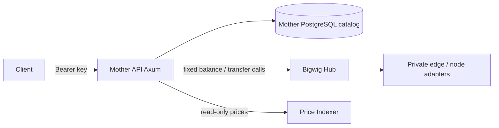
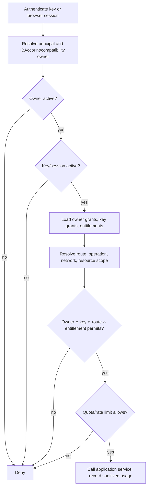
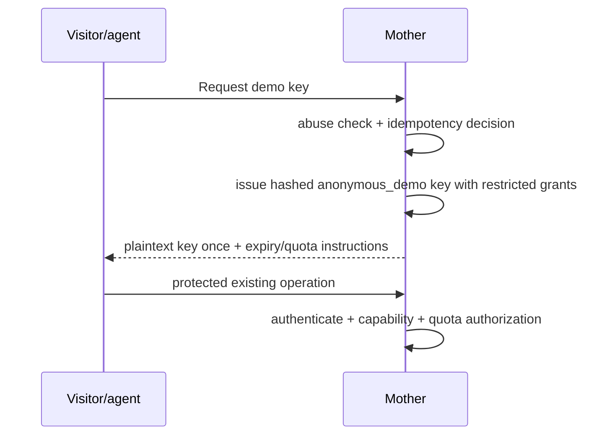
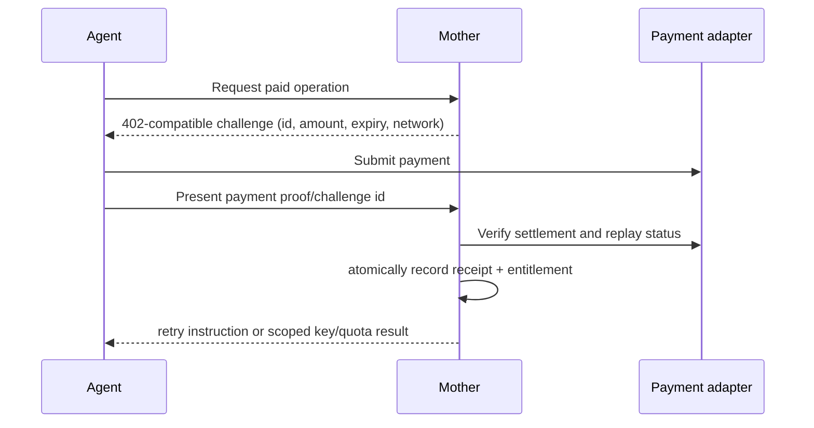
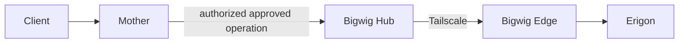
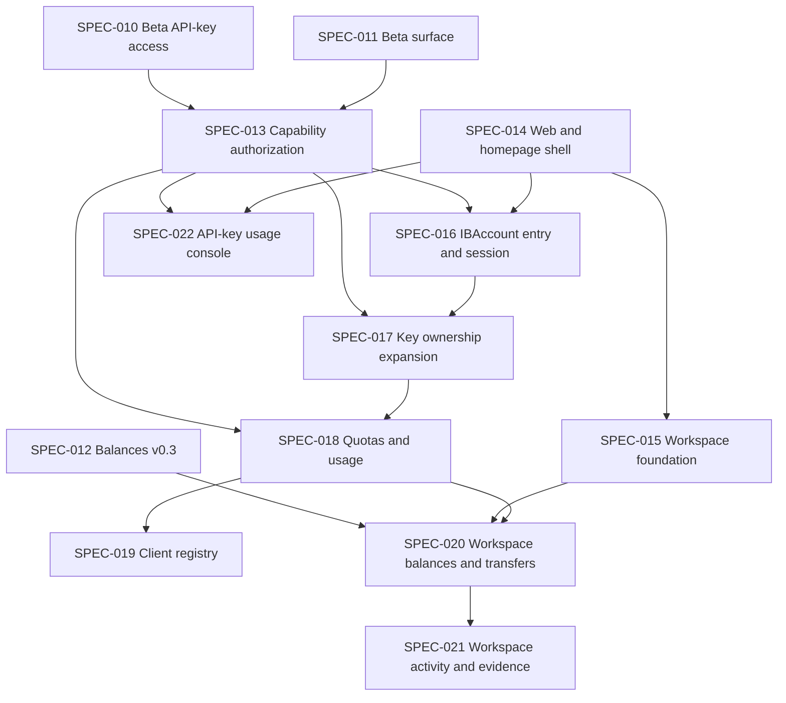

# RFC-003 - Mother API: Accounts, Capabilities, Scan, RPC and Agent Access

## Status

Accepted. This RFC is an internal architecture and release-coordination
decision. It changes no public route by itself; public behavior still requires
an accepted SPEC and the corresponding `CONTRACTS.md` update.

The hostname and human-route portions of this RFC are superseded by
[ADR-001](../adr/ADR-001-human-and-machine-domain-strategy.md). In particular,
the current product uses `www.ironburrow.com` for human pages and does not use
an `/app` route prefix or configure `app.ironburrow.com`.

## Internal codename note

The internal development codename **El Vasco** honors the musician Mezo
Bigarrena. The older internal codename was **El Malo**, in honor of the
musician Willie Colón. These names may occur in internal planning and
historical material only. They must not appear in public routes, OpenAPI
descriptions, user-facing HTML, public API documentation, or product copy.

## Summary

El Vasco is Iron Burrow's source-aware on-chain Data Lab. Mother API is the
runtime and policy boundary that delivers this product through multiple
presentations: homepage and Data Lab pages, structured JSON responses, CLI
consumers, and future agent-facing transports. It remains a product and policy
boundary, not a replacement for Bigwig, the Price Indexer, DIS, or the Read
Model.

The product has two delivery surfaces with intentionally different promises:
`/v1` is the small, stable, versioned production API for external
integrations; `/app` is the evolving Data Lab application surface for humans
and software agents. Shared application services power both. A capability
appearing in the Data Lab does not imply a corresponding public JSON endpoint.

The primary product entry is `app.ironburrow.com`. The homepage is part of the
product experience and does not depend on a separate marketing runtime.

The recommended first delivery is a **single Mother API Rust runtime** with
Askama server-rendered pages added in a later, dedicated SPEC. It shares
domain and application services with JSON endpoints. The first implemented
vertical slice is smaller: registered `balances.read` and `transfers.read`
capabilities protect the existing private-Beta routes while preserving all
issued-key behavior.

## Context and current state

The following state was verified from routes, migrations, OpenAPI, adapters,
and tests on 2026-07-30:

| Area | Verified current behavior |
| --- | --- |
| Runtime | One `mother-api` Axum binary; no Cargo workspace, Askama dependency, browser session, or `/app` route. |
| Production API | `GET /health`; `POST /v1/balances`; `POST /v1/balances/bulk`; and feature-gated `POST /v1/erc20-transfers/search` are the current private-Beta production API surface. Exact contracts are in `CONTRACTS.md`. |
| Alpha asset detail | `GET /v1/assets/{slug}` and its signal enrichments are implemented Alpha compatibility behavior governed by `CONTRACTS.md` and SPEC-002. They are not the model for new production API additions or the future Data Lab route design. |
| Credentials | Operator CLI issues high-entropy `ib_live_<prefix>.<secret>` bearer keys. Only SHA-256 hashes and non-secret prefixes are stored. |
| Ownership | `api_consumer` currently owns `api_key`; it is a Beta-consumer record, not an IBAccount. |
| Enforcement | Beta middleware authenticates a bearer key, requires active consumer/key and unexpired key, then applies in-memory per-minute and Postgres daily per-key limits. |
| Infrastructure | Balances and transfer extraction call fixed authenticated Bigwig internal endpoints. Mother has no generic RPC, Otterscan, Bitcoin, Lightning, or payment adapter. |
| OpenAPI | Utoipa generates the current JSON API document. |
| Data boundaries | Mother owns catalog data; Price Indexer is read-only for prices; DIS remains a dormant read-only DeFi-intelligence boundary and is not called by current Mother API production behavior. |

The first slice adds `mother_api.capability`, compatibility owner grants, and
key grants. Required capability declarations and compatibility-grant
reconciliation run through the embedded reference-data lifecycle, which gives
all existing consumers and keys only `balances.read` and `transfers.read`.
Middleware now returns the documented `403 capability_not_granted` before quota
consumption when a valid key lacks the route capability. It does **not** create
an IBAccount or expose new product functionality.

## Problem statement

The current bearer-key check proves possession but cannot safely express
product access, account limits, network restrictions, payment entitlements, or
advanced-node safety policy. Building Scan, Lab, anonymous keys, or payment
flows directly on it would duplicate authorization decisions and risk turning
Mother into an unrestricted node gateway.

## Product vision

Iron Burrow offers humans and agents a source-aware Data Lab for understanding
what happened on-chain, testing hypotheses against historical evidence, and
iterating on useful analyses. Visitors can evaluate approved capabilities with
constrained anonymous access, establish an Iron Burrow Account, organize
Workspace context, and later receive paid or plan-derived access where
applicable. Scan and Lab are product surfaces over shared application use
cases, not independent node proxies.

## Primary users

1. Anonymous users exploring tightly limited Data Lab capabilities.
2. Registered `IBAccount` users with persistent Workspaces and richer
  functionality.
3. Iron Burrow developers using the same product capabilities to design and
  validate new features.
4. Software agents that require structured, documented, source-aware
  interfaces.

El Vasco is agent-first and human-usable. Humans and agents use shared
application capabilities; presentation and transport differ by consumer.

## Product access and growth principles

Mother API exposes curated, documented capabilities rather than becoming a
generic blockchain data or RPC provider. New capability work starts from a
demonstrated consumer problem, then proceeds through an implementation SPEC,
an explicit contract decision where applicable, usage measurement, and
stabilization. Speculative endpoints are not added merely because they might
be useful.

The current `friend`, `partner`, `public`, and `internal` values on
`api_consumer` are operator-managed Beta consumer categories. They are
administrative metadata, not promises of self-service onboarding, dedicated
support, plan-based access, or billing. Protected private-Beta requests use
the implemented consumer/key capability and per-key quota controls; Alpha
public routes remain governed by `CONTRACTS.md`.

## Workspace as product primitive

Workspace is the first-class durable user boundary for Data Lab context and
analysis. It is not a required ticket/notebook/investigation workflow. An
`IBAccount` may own multiple Workspaces and explicitly select between them.

A Workspace may progressively contain watch-only addresses and account context,
labels, balances, transfers, positions, prices, treasury-oriented
groupings/calculations, historical snapshots, hypotheses, saved analyses,
reports, experimental capabilities, and append-only activity/evidence logs.

The minimum viable Workspace is intentionally smaller:

1. Workspace identity and account ownership.
2. Name and optional description.
3. One or more watch-only address registrations.
4. Labels.
5. Created and updated timestamps.
6. List/select Workspace operations.
7. Workspace-scoped balance and transfer views.
8. Append-only Workspace activity log.

## Treasury direction

Treasury functionality is a Workspace capability family, not a separate
standalone service in the first slice. Initial and future Workspace treasury
capabilities may include grouped watch-only addresses, balance rollups,
position snapshots, inflow/outflow analysis, valuation views, and
evidence-aware reporting.

MVP scope does not require all treasury features at once. Advanced treasury
analytics remain progressive Data Lab capabilities and may be promoted to
stable `/v1` only through the explicit promotion policy.

## Stable API and Data Lab boundary

`/v1` and `/app` are different products of the same Mother application, not
two versions of one API.

| Surface | Audience and promise | Delivery rule |
| --- | --- | --- |
| `/v1` | External developers and agents integrating against a stable, versioned production contract. | Keep intentionally small. Every addition needs demonstrated maturity, an accepted implementation spec, compatibility tests, OpenAPI coverage when applicable, and a coordinated `CONTRACTS.md` update. |
| `/app` | Humans and software agents using the evolving Data Lab application contract. | HTML pages, structured responses, and other presenters call shared application services and evolve under product authorization and focused specs. A Data Lab capability does not automatically create a public `/v1` JSON route. |

The accepted `/v1` production-beta surface remains operational for the
remainder of calendar year 2026, subject only to documented compatibility and
operational policy decisions.

The current private-Beta production API is deliberately limited to
`POST /v1/balances`, `POST /v1/balances/bulk`, and enabled
`POST /v1/erc20-transfers/search`; `/health` remains the public liveness probe.
The existing Alpha routes remain governed by their current contract while they
exist, but must not be treated as a precedent for adding exploratory product
capabilities to `/v1`.

Planned Data Lab route groups include:

```text
/app
/app/assets
/app/assets/{asset_slug}
/app/networks
/app/networks/{network_slug}
/app/prices
/app/prices/{asset_slug}
/app/workspaces
/app/workspaces/{workspace_id}
/app/lab
```

These are route-design targets, not implemented runtime routes or public API
promises. They require an authenticated account/session, page-specific
authorization, and focused implementation specs before delivery.

Capability maturity follows this lifecycle:

```text
idea
  ↓
lab experiment
  ↓
workspace or application capability
  ↓
optional pre-production maturity state
  ↓
production beta capability
  ↓
stable /v1 capability
```

Feature promotion to `/v1` follows this lifecycle:

```text
internal application capability
        ↓
available in /app
        ↓
validated through real usage
        ↓
formal production-API specification and compatibility decision
        ↓
promoted to /v1 only when appropriate
```

This sequence is intentionally one-way: the existence of an application
service or Data Lab page never creates an implied external compatibility
promise.

## Capability promotion policy

Implementation alone is insufficient for `/v1` promotion. Promotion requires an
explicit RFC, SPEC amendment, or production-readiness decision confirming:

1. Real customer dependency or credible willingness to pay.
2. Durable customer value.
3. Stable request/response contract.
4. Understood source/evidence semantics.
5. Defined authorization and abuse model.
6. Known operational cost and infrastructure behavior.
7. Documentation and examples.
8. Compatibility maintenance commitment.
9. Long-term support willingness from Iron Burrow.

## Internal application functions and UI boundary

El Vasco includes internal application and domain functions that support UI
delivery, internal orchestration, and read-model coordination. These functions
are not automatically public API routes and do not require a hardened
`CONTRACTS.md` entry in the same way as the public balances and transfer
operations. They still require clear ownership, authorization where relevant,
tests, and an accepted implementation SPEC when they create a durable
cross-service dependency.

Any public route or stable machine-facing API remains subject to an accepted
SPEC and the corresponding `CONTRACTS.md` update. Internal functions may use a
separate internal caller contract and can evolve without expanding the public
surface.

### Read-model catalog synchronization

The internal El Vasco application layer is the designated location for the
future catalog-discovery/synchronization function used by
`iron-burrow-read-model`. Mother API remains the owner of the canonical
`mother_api.global_asset`, `network`, and `asset_chain_map` catalog; the Read
Model remains the owner of refresh scheduling.

The future internal function or feed may provide the minimal active catalog
entries and refresh quote-currency information needed to build refresh
attempts. It must not turn public `GET /v1/assets` into an operational feed,
promise `/v1/assets/active`, move price derivation or historical price
ownership into Mother API, or expose read-model-specific fields through the
public contract. Its exact transport, visibility, response shape, freshness,
and failure semantics require a focused implementation SPEC before delivery.

### Data Lab asset-page capability

The implemented `GET /v1/assets/{slug}` Alpha composition provides useful
evidence for the future Data Lab asset-page view: canonical Mother-owned asset
identity and network maps, an always-present latest-price block, and optional
`priceStats`, `priceTrend`, and `priceSeries` enrichments. It is not the
required future Data Lab transport.

The Price Indexer remains the read-only owner of price availability,
derivation, statistics, trend formulas, time-series points, confidence, and
warnings. Mother composes the response, preserves successful provider payloads,
and returns an honest partial response when an optional enrichment is
unavailable; it does not calculate or reinterpret price intelligence locally.

The current JSON behavior remains governed by `CONTRACTS.md` and accepted
SPEC-002 while it exists. A later Data Lab asset-page implementation SPEC must
decide the `/app` route, template/view model, account authorization, loading
and partial-enrichment presentation, observability, and rollout. It must call
the shared asset application service rather than introduce a parallel public
asset or price API, and it must not turn the public asset catalog into a
read-model operational feed.

## Goals

- Preserve every existing production client route and key behavior.
- Establish deny-by-default, testable capability authorization.
- Add account, key, entitlement, quota, session, and payment concepts in
  separately reviewable steps.
- Serve the homepage and future authenticated HTML from this repository.
- Deliver Data Lab capabilities through authenticated `/app` pages and shared
  application services before considering them for the stable production API.
- Incorporate the implemented asset-detail composition into a Data Lab asset
  page through a focused follow-on SPEC, without duplicating price
  intelligence or creating an implied new JSON contract.
- Keep Mother as the public policy boundary and Bigwig as infrastructure
  protection close to nodes.

## Non-goals

- A generic identity platform, custody, wallet control, billing suite, or
  unrestricted RPC proxy.
- Arbitrary database queries, raw Erigon tunnels, Bitcoin wallet RPC,
  Lightning payment execution, or admin node RPC.
- Changing existing JSON route names or request/response shapes.
- Treating `/app` pages or internal application services as undocumented
  alternate public APIs.
- Implementing all planned products in this RFC.

## Terminology

| Term | Meaning |
| --- | --- |
| `IBAccount` | Explicit product account identifier and status boundary; not a blockchain address or session. |
| Workspace | Durable account-owned Data Lab boundary where watch-only context and analyses accumulate. |
| API key | Bearer credential with an ID, prefix, secret hash, kind, status, and narrower grants. |
| Client | Account-managed integration identity (for example CLI, agent, script, dashboard, bot) with isolated keys/scopes/audit. |
| Principal | Authenticated browser-session or API-key subject. |
| Capability | Application-defined permission such as `balances.read`. |
| Grant | Capability plus scope/status/expiry granted to an account or key. |
| Entitlement | Plan or verified-payment-derived authority that can contribute account grants or quota. |
| Resource scope | Network, method group, page size, lookback, product surface, or other bounded qualifier. |
| Payment receipt | Evidence handled by a provider adapter; never a bearer credential. |

## Architectural principles

- Deny by default; explicit denies, disabled state, expiry, quota, or
  infrastructure refusal win.
- API keys prove possession only. They never elevate their owner.
- Canonical public network identity is `network_slug`; EIP-155 `chain_id`
  remains distinct and is never a generic `chain` field.
- Delivery code delegates to application/domain policy; templates and handlers
  do not reimplement it.
- Mother and Bigwig enforce in depth. A Mother allow cannot override Bigwig.
- Secrets are display-once where applicable and never logged.

## Current architecture



DIS is intentionally absent from the current-runtime diagram: no current
Mother API capability calls it. `SPEC-001` retains DIS as a possible future
read-only protocol-intelligence boundary.

## Proposed architecture

```mermaid
flowchart TB
  Browser[Signed-in account holder] --> HTML[/app Data Lab delivery]
  Agent[External developer or agent] --> JSON[/v1 JSON/OpenAPI delivery]
  HTML --> App[Application services]
  JSON --> App
  App --> Authz[Authorization service]
  Authz --> Domain[Accounts, keys, capabilities, entitlements]
  App --> PG[(Mother PostgreSQL)]
  App --> Bigwig[Bigwig adapter]
  App --> Prices[Price Indexer adapter]
  App --> Payments[Payment provider adapters]
  Bigwig --> Edges[Hub, Tailscale, edges, nodes]
```

The delivery layer has a conservative JSON API and an authenticated HTML Data
Lab, plus OpenAPI, sessions, and CSRF protection. Application services own
onboarding, issuance, authorization, Data Lab composition, Scan orchestration,
and payments. Adapters contain PostgreSQL, email, Bigwig, Price Indexer, and
provider concerns.

## UI runtime and Cargo workspace decision

Three options were evaluated:

| Option | Result |
| --- | --- |
| Add pages to the existing binary | **Recommended first implementation.** One deployable, shared policy/services, no extra cross-service authentication. |
| Add a separate Rust binary/crate in this repository | Defer. It becomes justified only if independent scaling, isolation, or deployment cadence is concrete. |
| Separate UI application in this repository | Defer. It adds a second runtime, client-side authorization risk, and duplicated contract concerns before the product needs them. |

SPEC-014 adds Askama and static assets to the existing runtime. It must place
authenticated product pages under `/app`, keep them outside `/v1`, use
progressive enhancement only where it improves copying/forms, and preserve
JSON delivery behavior.

## Product surfaces

| Surface | Responsibility | Access |
| --- | --- | --- |
| Homepage | Product entry at `app.ironburrow.com` with Data Lab entry, account entry, anonymous path, and docs links. | Public. |
| Data Lab assets | `/app/assets` and `/app/assets/{asset_slug}` present asset identity, price composition, and charts through shared services. | Account or explicitly authorized client/agent context, plus page-specific authorization. |
| Data Lab networks and prices | `/app/networks`, `/app/networks/{network_slug}`, `/app/prices`, and `/app/prices/{asset_slug}` host validated product views and experiments. | Account or explicitly authorized client/agent context, plus page-specific authorization. |
| Workspaces | `/app/workspaces/*` manages durable Workspace context, watch-only membership, labels, and scoped activity. | Account-owned authorization, with optional delegated client access. |
| Account and Client management | `/app` account/session, verified identity, key management, client registry, entitlement, and usage views. | Application authorization over browser or structured presenters. |
| Data Lab | `/app/lab` hosts advanced, explicitly granted research, diagnostics, and datasets. | Capability and quota controlled. |
| Machine API | `/v1` exposes only stable documented JSON operations. | API key and capability controlled. |

Data Lab presenters and the machine API are separate delivery surfaces over
shared use cases, not separate applications in the initial deployment.

## Shared application capability model

Business logic lives in Mother domain and application services. Presentation
layers render those outcomes for different consumers.

```text
Domain and application services
  ↓
Presentation-independent results
  ↓
JSON/API presenter
Askama/HTML presenter
CLI presenter
Future agent/MCP presenter
```

Route handlers and templates must not bypass application boundaries and query
infrastructure adapters directly.

## Identity and IBAccount model

`IBAccount` is the public domain term. Its minimal first model has a random
public `iba_*` identifier, immutable internal UUID, status
`pending_verification|active|suspended|closed`, timestamps, and one or more
verified email identities. It does not claim ownership of a blockchain
address. An API key belongs to at most one IBAccount after migration.

Browser sessions authenticate a principal, resolve its IBAccount, and call the
same application authorization service as API-key requests. Session IDs are
opaque, hashed at rest, rotated at login/privilege changes, bound to a limited
lifetime, protected by secure/HTTP-only/same-site cookies, and checked for
CSRF on state-changing browser actions.

```mermaid
sequenceDiagram
  participant U as User
  participant M as Mother
  participant E as Email provider
  U->>M: Sign up with email
  M->>M: create pending IBAccount + verification hash
  M->>E: send one-time verification link
  U->>M: verify link
  M->>M: activate identity/account; create rotated session
  U->>M: account action with session + CSRF token
  M->>M: authorize IBAccount before service call
```

## API-key model

`ApiKey` has an independent secret, public key ID/prefix, kind
`account|anonymous_demo|agent`, label, status, secure hash, issue/expiry/
revocation timestamps, last-used metadata, and key-level grants. Raw secrets
are shown once only. SHA-256 remains acceptable only for generated
high-entropy keys; passwords use a different future mechanism.

Future ownership variants are modeled explicitly: an API key may be owned by
an `IBAccount`, by a `Client`, by an organization principal, or by no owner
for explicitly anonymous access. A key must not simultaneously belong to
unrelated principals.

Account grants are the upper boundary. Key grants are evaluated dynamically,
not copied as a replacement for the account boundary. A new key can be
narrower; an account grant removal immediately constrains every key. Key
creation may copy a starter proposal for UX but authorization always computes
the intersection.

## Capability and resource-scope model

The immediate registry contains only `balances.read` and `transfers.read`.
Target identifiers, introduced only in their owning SPECS, include:

`prices.read`, `prices.private_query`, `scan.read`, `rpc.basic`,
`rpc.custom`, `otterscan.read`, `bitcoin_core.read`, `lightning.read`, and
network-scoped capabilities such as `ethereum_mainnet.read` where a stable
identifier is useful.

A grant contains capability, network scope (`*` or canonical `network_slug`),
status, expiry, source, and audit fields. Later scopes can include route group,
approved RPC method/method group, maximum page size/lookback, historical-data
permission, concurrency, and quota. Capability IDs are application-defined;
users do not create capabilities.

## Authorization algorithm



Formally:

`effective_access = account_grants ∩ api_key_grants ∩ resource_scope ∩ route_policy ∩ current_entitlements ∩ quota_and_payment_state`.

The compatibility slice substitutes existing `api_consumer` owner grants for
IBAccount grants temporarily. It does not call that record an IBAccount.

| Case | Owner grant | Key grant | Result |
| --- | --- | --- | --- |
| Verified account key | balances + transfers on Ethereum | balances + transfers | Allow matching operations. |
| Narrow key | balances + transfers | balances only | Deny transfer. |
| Anonymous demo | demo baseline | balances only, short expiry | Deny advanced operations. |
| Paid agent | payment-derived scope | narrower agent scope | Allow intersection only. |
| Expired/revoked key | any | inactive | Deny. |
| No network grant | balances on Base | balances on Ethereum | Deny Base. |
| Advanced key request | no Otterscan owner grant | Otterscan key grant | Deny. |

## Anonymous-key flow

Anonymous demo keys should exist without an IBAccount. They use a dedicated
anonymous principal class and audited key record, avoiding fake identities and
an unnecessary provisional-account migration. Creation receives strict
IP/device and abuse controls, rate/day quotas, short expiry, revocation,
display-once secret behavior, and only the approved existing basic
capabilities plus explicit network scopes. No arbitrary RPC, Otterscan,
Bitcoin, Lightning, premium prices, account management, or custom RPC is
allowed.



An upgrade creates or verifies an IBAccount, revokes/links the demo key by an
explicit audited action, and never silently broadens it.

## Verified-account flow

SPEC-016 defines email verification, a minimal recovery mechanism, sessions,
and active/suspended/closed rules. Account creation must have generic public
responses to prevent email enumeration. Key issuance and browser actions use
the same authorization service; browser possession does not bypass account
status, entitlements, or quotas.

## Agent and 402 payment flow

Payment is an entitlement input, not authentication and not a root
credential. A payment provider adapter creates a bounded challenge; a client
pays; the adapter verifies settlement once; Mother records an idempotent
receipt and creates/extends a time-limited entitlement. A key is separately
issued or explicitly extended under that entitlement.



MPP and Coinbase-compatible x402 are provider implementations behind this
boundary. Configuration, not a credential, determines accepted stablecoins and
payment networks. The payment SPEC sets confirmation depth/policy per asset;
pending, failed, expired, underpaid, duplicate, and reversed receipts do not
grant access. Challenges/receipts have expiry, nonce/idempotency keys,
provider transaction uniqueness, audit events, and a deferred but modeled
refund/reversal state.

## Address associations

An association may be watch-only, labelled, user-declared, control-verified,
imported for monitoring, or treasury/organization-labelled. The first version
supports only private watch-only associations and labels. It must never say an
IBAccount owns an address without cryptographic verification. Associations
support saved Scan/Lab views later; they are private account data with clear
retention/deletion policy and must not alter public chain facts.

## Scan architecture

Initial Scan is `/app/scan/{network_slug}` plus task-oriented Data Lab views,
not a raw RPC surface. Its MVP is Ethereum-mainnet transaction lookup,
confirmation evidence, address balances, and ERC-20 transfers using existing
Mother/Bigwig capabilities. Browser sessions can request operations only when
their page policy and scopes allow them; any machine API delivery requires a
separate promotion decision. Historical evidence and advanced data arrive in
later SPECS.

## Price access

The Data Lab presents curated price views, trends, and scoped historical
research while the Price Indexer remains owner of availability, derivation, and
historical data. `prices.private_query` means a curated application query with
validated parameters and limits, never direct database access. Data Lab price
views, internal query-layer calls, and a future promoted public price API are
distinct policies. No Data Lab price capability is a `/v1` endpoint unless it
passes the promotion lifecycle above.

## Source-awareness requirements

Reliable data means source-aware data, not only numerically plausible values.
Where relevant, application and presenter outputs should preserve or expose:

1. Canonical `network_slug`.
2. Upstream source identity.
3. Block number.
4. Block hash when available.
5. Block timestamp.
6. Request resolution time.
7. Requested historical point and resolved historical point.
8. Price source and price timestamp for valuation outputs.
9. Data-completeness indicators and partial-failure reporting.
10. Confidence or quality indicators when formally defined by the owning
  service.

## Basic and custom RPC

`rpc.basic` is a reviewed method profile with request/response/batch size
limits, parameter schemas, timeouts, concurrency, rate and method policy,
network scope, audit events, and normalized errors. Mother validates product
authorization and request shape; Bigwig independently enforces node-close
method policy and protection. `rpc.custom` is deferred until the basic profile
is proven, then requires explicit per-method grants, elevated approval, and
stronger limits. Neither is implemented by this RFC.

## Otterscan integration

Otterscan is a restricted capability to approved `ots_*` methods, never an
Erigon tunnel. Mother owns principal/key/entitlement policy and an exposed
task-or-constrained-RPC contract; Bigwig owns the node-close allowlist,
parameter/limit defense needed to protect the edge, and supported-capability
discovery. The expected path is:



SPEC-024 decides task-oriented versus constrained RPC-compatible delivery,
API-level probing, version incompatibility behavior, and exact `ots_*`
methods. Anonymous demos are categorically denied.

## Bitcoin Core integration

A future `bitcoin_core.read` capability permits only curated, read-only public
inspection, node status, and transaction/indexed-address information through
Bigwig. Wallet RPC and administrative RPC are excluded unless a later security
review explicitly approves them.

## Lightning integration

A future `lightning.read` capability permits curated read-only node, invoice,
payment-status, channel, and liquidity information. Payment execution and
administrative operations are outside this RFC and the initial implementation.

## Mother and Bigwig boundaries

Mother owns product HTTP/HTML, IBAccounts, keys, sessions, capabilities,
entitlements, plans, quotas, product authorization, Scan/Lab orchestration,
documentation, and product usage records. Bigwig owns private connectivity,
Hub-to-edge routing, node adapters, node-close allowlists, infrastructure
timeouts/limits, and supported-node discovery. Both layers deny independently.

Mother is the product/business control plane and answers:

> Should this caller be allowed to perform this Iron Burrow product action?

Bigwig is the infrastructure safety plane and answers:

> Can the underlying infrastructure safely execute this operation?

Mother may impose stricter business/customer limits. Bigwig may independently
impose stricter infrastructure safety limits.

## Proposed persistence model

Immediate migration `0009` adds only the `capability`,
`api_consumer_capability_grant`, and `api_key_capability_grant` schemas. The
embedded reference-data catalog declares the required capability registry and
reconciles legacy owner/key grants after migrations. Their PKs are the natural
owner/capability/network tuple; scopes are `*` or canonical `network_slug`;
status/expiry/revocation/audit timestamps support the next phase; active lookup
indexes serve authorization. They deliberately do not pretend `api_consumer`
is an IBAccount.

| Later table | Key fields and constraints |
| --- | --- |
| `ib_accounts` | UUID PK, unique `iba_*` public ID, status, created/updated/closed timestamps. |
| `account_identities` | UUID PK, IBAccount FK, normalized email hash/value policy, verification status, unique verified identity. |
| `email_verifications` | UUID PK, identity FK, one-time secret hash, purpose, expiry/consumed/revoked timestamps, lookup index. |
| `browser_sessions` | UUID PK, account/identity FK, secret hash, expiry/revoked/rotated fields, active-session indexes. |
| `api_keys` | Retain secret hash/prefix; add `ib_account_id`, kind, and safe legacy migration fields. |
| account/key grants | Account FK or key FK, capability, scope, status, source, expiry/revocation; unique active logical scope. |
| `entitlements` | UUID/public ID, account FK, source/provider reference, capability/plan/quota payload, active window, idempotency uniqueness. |
| `attached_addresses` | UUID, account FK, family/network/address normalized key, association/verification status, label, privacy timestamps. |
| `usage_events` | UUID, principal/key/account IDs, operation/scope/outcome/cost, redacted metadata, time indexes. |
| `payment_challenges` | UUID/public challenge ID, provider/config snapshot, amount/asset/network, nonce/idempotency, expiry/status. |
| `payment_receipts` | UUID, challenge FK, provider transaction uniqueness, verified amount/status/confirmation, reversal/audit fields. |

## API and Data Lab routes

The following Data Lab routes are proposals, not implemented runtime routes.
They require their owning SPECS and browser authorization. A route becomes a
public machine contract only if it is separately promoted to `/v1` and added to
`CONTRACTS.md`:

| Route group | Proposed purpose |
| --- | --- |
| `/` | Homepage delivered on `app.ironburrow.com` as product entry. |
| `/docs` | Human API documentation plus link/download for OpenAPI. |
| `/get-api-key` | Demo onboarding; never a privilege escalation endpoint. |
| `/login`, `/verify-email` | Minimal verified-account flow. |
| `/app` | Authenticated Data Lab home and account entry. |
| `/app/workspaces`, `/app/workspaces/{workspace_id}` | Workspace creation, selection, membership management, scoped activity/evidence log. |
| `/app/assets`, `/app/assets/{asset_slug}` | Asset pages over shared Mother asset services. |
| `/app/networks`, `/app/networks/{network_slug}` | Network statistics and research views. |
| `/app/prices`, `/app/prices/{asset_slug}` | Curated price views and trends. |
| `/app/lab` | Explicitly authorized diagnostics, research, and experimental datasets. |
| `/app/scan/{network_slug}` | Account-authorized Scan landing and task-oriented detail views. |

Existing `/v1/*` paths remain governed by their current contracts. Future
Data Lab pages call shared application services directly. A future JSON
endpoint uses a versioned contract, exact route-to-capability mapping, and
OpenAPI compatibility tests only after deliberate promotion to `/v1`.

## Security analysis

| Threat | Required control |
| --- | --- |
| Key theft/enumeration/leakage | High entropy, hash-only storage, display once, non-enumerating auth, redact headers/logs/traces. |
| Email/account abuse | Generic responses, short one-time verification tokens, rate limits, expiry, audit, session rotation. |
| Demo farming | Layered issuance abuse controls, strict quota/expiry, no advanced grants, revocation. |
| Capability escalation | Intersection algorithm, owner upper boundary, deny precedence, table-driven tests, immutable capability registry. |
| Cross-account access | Principal-to-account ownership checks in application services; opaque identifiers do not authorize access. |
| RPC DoS/batches/oversize | Mother and Bigwig method/parameter/batch/timeout/response/concurrency limits. |
| 402 replay/forgery | Challenge nonce, provider verification, transaction uniqueness, idempotency, confirmation policy, receipt audit. |
| Address privacy | Private associations, minimal metadata, retention/deletion rules, no ownership claims. |
| Session fixation/CSRF/XSS | Rotate sessions, secure cookies, CSRF checks, Askama autoescaping/default-safe template use and CSP review. |
| Bigwig/edge compromise | Least-privilege service credentials, node-close enforcement, segmented networking, sanitized upstream errors. |
| Bitcoin/Lightning admin exposure | Explicit allowlists; wallet, execution, and admin methods prohibited by default. |

## Quotas and rate limits

The existing per-key minute and daily limits remain unchanged. Later policy
supports per-key, account, capability, method, route, concurrency, anonymous,
and entitlement-derived quota budgets. Reservation/consumption must be atomic
for the resource being limited. Rate limiting and quota decisions are distinct
but both deny before expensive upstream work.

## Auditing and observability

Record opaque principal/key/account IDs, operation/capability/scope, decision,
quota outcome, latency, response class, correlation ID, and upstream class.
Never record raw API keys, session secrets, payment proofs/secrets, provider
credentials, raw sensitive address labels, or unrestricted request bodies.
Alert on issuance spikes, authorization-deny spikes, payment replay attempts,
and Bigwig denials without exposing customer secrets.

## Backward compatibility

`POST /v1/balances`, `POST /v1/balances/bulk`, and enabled
`POST /v1/erc20-transfers/search` retain paths, request/response schemas,
authentication header, and legacy key access. The required reference-data
apply explicitly reconciles each existing consumer and key with exactly the two
pre-existing capabilities. New operator-issued legacy keys receive the same
default grants.
No key becomes more powerful. Missing/expired/revoked credentials retain the
same `401`; a valid but deliberately narrowed future key receives stable `403`.

## Migration and rollout

1. Run `mother-api db apply` so migration `0009` and required capability
   reference data are both applied.
2. Deploy capability-aware code with metrics for grant lookup/denial.
3. Verify all issued production keys have owner and key baseline grants before
   enabling any subsequent route-to-capability policy.
4. Run OpenAPI, route characterization, and disposable-Postgres tests.
5. Roll back application code only after confirming old code tolerates grant
   tables; migrations are additive and retained. Do not delete reference data
   or grants as a rollback mechanism.
6. Feature-gate later public UI, account, demo, payment, Scan, and node work
   independently. No rollout grants an advanced capability by default.

## SPECS required

The implementation map is intentionally split into:

1. Existing active/accepted specs already present in `docs/specs`.
2. New draft specs required for the first end-to-end Data Lab slice.
3. Deferred roadmap specs that are intentionally out of the first slice.

### Existing active/accepted baseline specs

| SPEC | Current role for El Vasco |
| --- | --- |
| SPEC-010 | Private-Beta API-key access-service foundation. |
| SPEC-011 | Private-Beta route-surface consolidation for `/v1` operations. |
| SPEC-012 | Balance endpoint v0.3 contract and historical-support semantics. |
| SPEC-013 | Capability-authorization intersection foundation. |
| SPEC-014 | Web/homepage runtime shell in the existing Mother deployment. |
| SPEC-002 / SPEC-003 / SPEC-007 | Source-aware asset/price/transfer capability boundaries reused by Data Lab experiences. |

### New or amended near-term specs

| SPEC | Type | Purpose |
| --- | --- | --- |
| SPEC-015 | New draft | Workspace foundation and scoped analysis boundary. |
| SPEC-016 | Planned draft | `IBAccount` verified identity and account entry/session lifecycle. |
| SPEC-017 | Planned draft | API-key ownership expansion (`IBAccount`, anonymous, future client/org compatibility invariants). |
| SPEC-018 | Planned draft | Quotas, allowances, and usage accounting model beyond current Beta defaults. |
| SPEC-019 | Planned draft | Client registry and delegated key/access model. |
| SPEC-020 | Planned draft | Workspace-scoped balance and transfer application views under `/app`. |
| SPEC-021 | Planned draft | Workspace activity/evidence log and source-aware presentation policy. |
| SPEC-022 | New draft | API-key usage console (`/app/access`, `/app/usage`) with key-holder sessions and capability-labelled usage events. |

### Deferred roadmap specs (not required for first slice)

| Area | Deferred scope |
| --- | --- |
| Payment/402 | Entitlements and settlement integration. |
| Advanced RPC/Otterscan | Additional capability families behind dedicated safety specs. |
| Bitcoin/Lightning | Out of active implementation plan without a dedicated accepted RFC. |

Each new draft spec must include purpose, scope, non-goals, dependencies,
security relevance, domain/database changes, public interfaces, acceptance
criteria, and implementation phase before acceptance.

## Phased implementation plan

| Phase | Deliverable and dependency-aware exit |
| --- | --- |
| 0 | This RFC update, gap reconciliation, and baseline spec map. |
| 1 | Preserve current `/v1` contract operation with SPEC-010/011/012/013 controls. |
| 2 | Product entry shell at `app.ironburrow.com` and Data Lab runtime seam via amended SPEC-014. |
| 3 | Account entry and caller classification (`IBAccount` and anonymous) via SPEC-016/017. |
| 4 | Workspace MVP (SPEC-015) plus Workspace-scoped balances and transfers (SPEC-020). |
| 5 | Workspace source/evidence activity log and agent-facing structured equivalent (SPEC-021). |
| 6 | Treasury and historical analysis capabilities evolve incrementally after the vertical slice is operational. |

## Release-tracking checklist

This checklist maps RFC-003 promises to the current repository state as of
2026-07-31. Checked items are implemented or already captured in an accepted
or draft artifact in this repository. Unchecked items remain planned.

- [x] Phase 0: land the RFC update, reconcile the first-slice gap, and keep a baseline spec map for El Vasco.
- [x] Phase 1: preserve the current Beta `/v1` route surface and existing key behavior while enforcing capability-based authorization for `balances.read` and `transfers.read`.
- [x] Keep the public machine API deliberately small: `/health`, `POST /v1/balances`, `POST /v1/balances/bulk`, and feature-gated `POST /v1/erc20-transfers/search` remain the supported Beta routes.
- [x] Keep route and error-contract hardening in place for Beta auth and authorization behavior, including stable `401 unauthorized`, `403 capability_not_granted`, `429 rate_limited`, `503 database_unavailable`, and `403 endpoint_disabled` behavior.
- [x] Keep the embedded capability registry and legacy owner/key grant reconciliation in the database lifecycle.
- [x] Keep OpenAPI and `CONTRACTS.md` aligned with the protected Beta route surface and capability-aware errors.
- [x] Capture the `/app` runtime shell and homepage work in a dedicated follow-on spec (SPEC-014).
- [x] Capture the Workspace foundation in a dedicated follow-on spec (SPEC-015).
- [x] Phase 2: add the repository-owned homepage at `/` for `app.ironburrow.com` in the existing Mother runtime.
- [x] Add the first `/app` runtime seam and server-rendered HTML delivery without creating a second service.
- [x] Add bounded static asset delivery, reviewed HTML headers/CSP, and the public docs entry route described by SPEC-014.
- [x] Ensure public HTML and docs surfaces contain no internal codename leaks.
- [ ] Phase 3: implement caller resolution for verified accounts and anonymous callers.
- [ ] Implement `IBAccount` identity, verified email flow, browser sessions, and session/CSRF policy through SPEC-016.
- [ ] Expand API-key ownership beyond the legacy compatibility owner so keys can belong to `IBAccount`, anonymous demo, and later client/org principals through SPEC-017.
- [ ] Implement anonymous demo-key issuance with strict expiry, abuse controls, and no privilege escalation.
- [ ] Phase 4: deliver the Workspace MVP as the first durable Data Lab primitive.
- [ ] Implement Workspace create/list/select/archive behavior with account ownership boundaries.
- [ ] Implement watch-only address registration and labels inside Workspaces.
- [ ] Deliver Workspace-scoped balance and transfer views under `/app` through SPEC-020.
- [ ] Phase 5: implement the append-only Workspace activity/evidence log and an agent-facing structured equivalent through SPEC-021.
- [ ] Preserve source-awareness in Data Lab outputs, including network, block/time evidence, price timestamps, and partial-failure indicators where relevant.
- [ ] Phase 6: expand treasury and historical analysis capabilities incrementally after the vertical slice is operational.
- [ ] Add curated Data Lab asset, network, price, scan, and lab experiences only through focused accepted specs and shared application services.
- [ ] Keep any future `/v1` expansion behind deliberate promotion decisions, accepted specs, compatibility tests, and coordinated `CONTRACTS.md` updates.
- [ ] Write the planned near-term specs that do not yet exist: SPEC-016, SPEC-017, SPEC-018, SPEC-019, SPEC-020, and SPEC-021.
- [ ] Implement the later quota and usage-accounting model beyond current Beta defaults through SPEC-018.
- [ ] Implement the future client registry and delegated access model through SPEC-019.
- [ ] Keep payment/402 entitlements, advanced RPC/Otterscan, and Bitcoin/Lightning work deferred until dedicated accepted specs exist.

### Phase 0 execution checklist

Phase 0 is complete when maintainers can point to one authoritative artifact
for each first-slice control and one executable proof path for each control
that affects runtime behavior.

| Area | Control | Primary source | Proof path |
| --- | --- | --- | --- |
| Route surface | Beta keeps only `/health`, `/v1/balances`, `/v1/balances/bulk`, and feature-gated `/v1/erc20-transfers/search`; known Alpha routes return `403 endpoint_disabled`. | `CONTRACTS.md`, SPEC-011, router composition | `src/adapters/http/router/tests.rs`, `docs/runbooks/smoke-tests.md` |
| Auth failures | Missing/invalid/inactive credentials remain non-enumerating `401 unauthorized`; auth storage outage returns `503 database_unavailable`. | `CONTRACTS.md`, SPEC-010 | `src/adapters/http/router/tests.rs`, `scripts/smoke/beta-auth.sh` |
| Capability authorization | Valid key without required operation grant returns `403 capability_not_granted` before quota consumption and handler execution. | SPEC-013, `src/adapters/http/auth.rs` | `src/adapters/http/auth.rs` tests, `scripts/smoke/beta-auth.sh` |
| Quota behavior | Valid key over configured limit returns `429 rate_limited` without executing protected handler. | `CONTRACTS.md`, SPEC-010 | `src/adapters/http/auth.rs` tests, `scripts/smoke/beta-auth.sh` |
| Grant lifecycle | `db apply` creates capability tables and reconciles legacy owner/key grants for existing keys. | migration `0009`, `reference-data/catalog.json`, `src/reference_data.rs` | `src/adapters/postgres/tests.rs` |
| OpenAPI contract | Protected routes include bearer security plus `401`, `403`, `429`, and `503` examples. | `src/openapi.rs`, `CONTRACTS.md` | `src/openapi.rs` tests |

Known documentation drift to track in Phase 0 reconciliation output:

- SPEC-011 remains accepted as the private-Beta release consolidation record
  but still contains v0.2-oriented wording in sections now covered by the
  v0.3 balance contract baseline in SPEC-012 and `CONTRACTS.md`.
- This first slice does not edit SPEC-011; maintainers track and resolve this
  drift in a dedicated documentation follow-up without changing the current
  contract source-of-truth order.

### SPEC dependency graph



### Recommended implementation order

1. Product homepage and Data Lab entry (`app.ironburrow.com`) with clear
   anonymous or account path.
2. Caller resolution model (anonymous vs registered).
3. Account creation or account entry.
4. Workspace creation, listing, and selection.
5. Watch-only address registration.
6. Workspace-scoped balance view.
7. Workspace-scoped transfer view.
8. Source/evidence display in Workspace context.
9. Agent-facing structured equivalent over shared application capabilities.
10. Treasury and broader historical capabilities incrementally afterward.

## Acceptance criteria

- Existing Beta routes and keys pass compatibility/OpenAPI tests.
- Authorization is a domain-level intersection, with owner denial and key
  narrowing covered by table-driven tests.
- Existing keys have explicit, non-broadened grants after migration.
- No new raw RPC, Otterscan, Bitcoin, Lightning, payment, or public HTML
  capability is introduced by the first slice.
- No Data Lab capability creates a `/v1` route or public compatibility promise
  without a deliberate promotion spec and coordinated contract update.
- Each later product capability has an accepted dependency SPEC before code.
- Public docs contain no internal codename.

## Alternatives considered

- Separate frontend service now: rejected for initial cost and duplicated
  authorization; revisit only with a concrete isolation/scaling need.
- Treat every API key as an account: rejected because credentials, accounts,
  and payment/session identities have distinct lifecycle/security properties.
- Make a payment receipt a credential: rejected; replay and provider coupling
  would make authorization unsafe.
- Place all node policy in Mother: rejected; Bigwig must protect infrastructure
  near the node as a second enforcement layer.
- Give anonymous demos a provisional account: deferred; a dedicated anonymous
  principal is simpler and avoids weak/fictional identity records.
- Treat the Data Lab as an unversioned public JSON API: rejected; its browser
  product behavior evolves independently while `/v1` remains conservative.

## Open questions

| Question | Recommended default |
| --- | --- |
| Client vs organization key precedence when both exist | Reserve architecture now; finalize conflict-resolution semantics in a dedicated authorization RFC before implementation. |
| Cross-Workspace collaboration model | Keep first release single-account ownership; decide organization-shared Workspace semantics in a future RFC. |
| Promotion governance body for `/app` to `/v1` decisions | Require explicit readiness review; assign owner/process in a lightweight governance RFC note. |
| Runtime extraction trigger thresholds | Keep one deployable runtime now; finalize concrete trigger metrics in an ADR when scale pressure appears. |

## Recommended decisions

Adopt the single-runtime Askama direction; make `IBAccount` the explicit
future owner boundary; keep anonymous demos accountless and severely scoped;
ship the first product entry at `app.ironburrow.com`; establish Workspace as
the durable Data Lab primitive; standardize `Client` as the integration term;
deliver `/app` capabilities for humans and agents before considering `/v1`
promotion; enforce dynamic account/owner ∩ key grants; treat payments as
verified entitlement inputs; and defer advanced node capability families behind
focused specs and Bigwig defense-in-depth boundaries. The first slice already
establishes the compatibility-safe authorization substrate for these
decisions.
